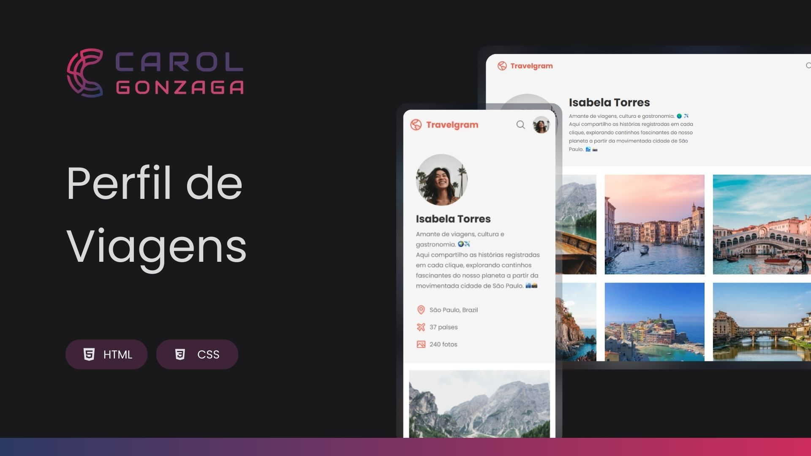

  

 

Projeto de um perfil de viagens para explorar destinos ao redor do mundo por meio de imagens e descrições, desenvolvido com foco em experiência do usuário.

  <a href="#-tecnologias">Tecnologia</a>&nbsp;&nbsp;&nbsp;|&nbsp;&nbsp;&nbsp;<a href="https://carolgonzaga.github.io/perfil-de-viagens/">Acesse o Projeto</a>

 
 

  

 
 

## 🚀 Tecnologias

Esse projeto foi desenvolvido com as seguintes tecnologias:

- HTML5
- CSS3

 
 

## 🎯 Objetivo

O objetivo desse projeto é criar um perfil de viagens interativo e visualmente atraente, aplicando conceitos aprendidos em aula.
